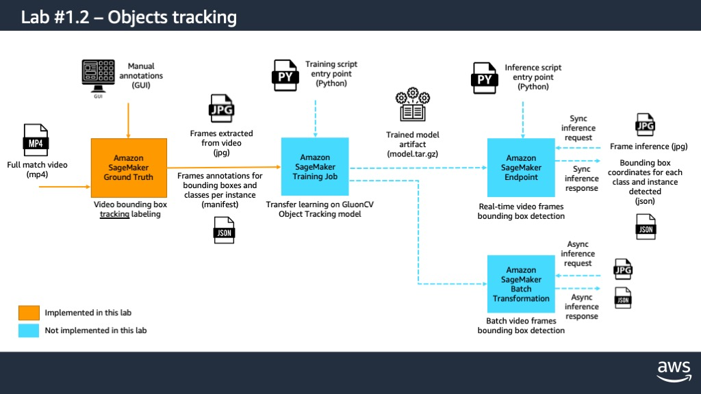

# ml-sports-media
Laboratories for automatic sport's media processing with AWS AI & ML services.

### Pre-requisites and notes:

1. Each of the following labs include a Jupyter notebook for following the instructions in the cells and code; the notebooks are designed to be deployed with Amazon SageMaker. You can either use SageMaker Studio IDE or a traditional SageMaker Notebook instance. For instructions on how to onboard with SageMaker Studio visit: https://docs.aws.amazon.com/sagemaker/latest/dg/gs-studio-onboard.html

2. For starting the work with the labs first clone this repository to your notebook environment. In SageMaker Studio go to "File", "New", "Terminal", then in the new terminal window write:

`git clone https://github.com/rodzanto/ml-sports-media`

3. Go to the file browser in the left pane, you should now see the folder with the copy of the "ml-sports-media" repository. You can access the Lab #1 and open the corresponding Jupyter notebook. Follow the instructions in the notebook.

4. Proceed with Lab #2.

5. Proceed with Lab #3.

### [Lab #1: Object detection & tracking for sport videos with Amazon SageMaker](./Lab1_object_detection/Lab1_object_detection.ipynb)

**Goal:** Classify and track objects (e.g. ball, specific players) in stored videos for sports (e.g. football, basketball). Rely on SageMaker for this (Ground Truth?, Processing?).

### [Lab #2: Activity detection for sport videos with Amazon SageMaker](./Lab2_activity_detection/Lab2_activity_detection.ipynb)

**Goal:** Classify activities (e.g. shot, pass, nice play) in stored videos for sports (e.g. football, basketball). Rely on SageMaker for this (Processing?).

### [Lab #3: Automatic highlights clipping for sports videos with Amazon SageMaker](./Lab3_automatic_clipping/Lab3_automatic_clipping.ipynb)

**Goal:** Process videos of sports based on activity classification for automatically clipping highlights with relevant plays.

